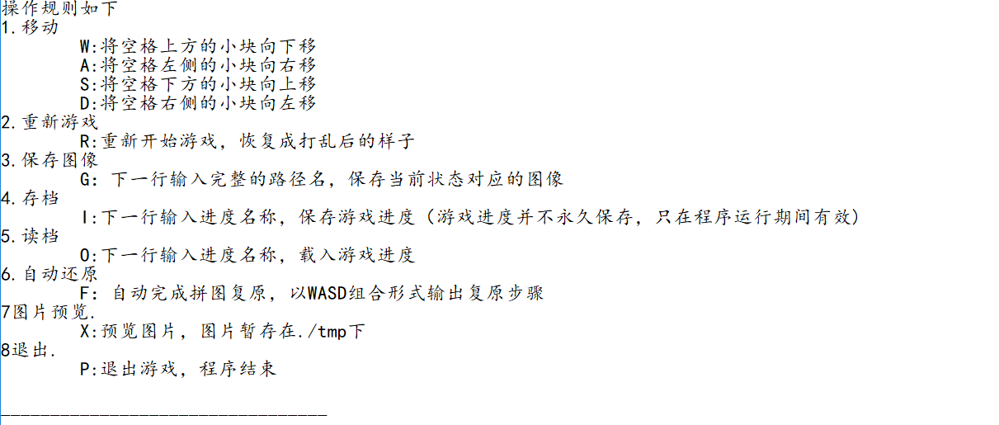

# puzzle_meow
C++大作业，喵之拼图

## 运行流程
1. 安装运行环境
* 先在本地装好opencv的环境，这里只有这个项目的源码，装环境这里不赘述
* 这里给出了最后生成的windows可执行文件，里面有一个opencv的dll文件，二者必须在同一目录之下才可以
2. 输入图片地址
* 不同操作系统地址会有点不同，开发整个是在windows下进行的，mac和linux没有测试过。
* 项目中有一张作为默认狗粮
3. 输入拼图规模
* 拼图被划分成 N * M ，这里要输入 N 和 M
* 3阶的时候已经出现明显卡顿了，阶数太高肯定是不行的，毕竟核心算法的复杂度是n!
4. 随机打乱图片块
* 有一半的概率可以生成能完整复原的图片
* 当生成了不能复原的打乱图片，控制台会给出提示
* q表示退出，其他按键都可以执行下去
* 当生成了可以完整复原的图片时，就正式进入游戏
5. 游戏时，已经给出了详细的规则，这里给出一张截图

* 注意：除了上述规则中所提到的输入，其他输入都会被认为非法输入，会把规则重新打印出来，重新输入，包括一般可以退出程序的快捷键（ctrl +C  Alt +F4)需要程序退出可以根据规则退出
